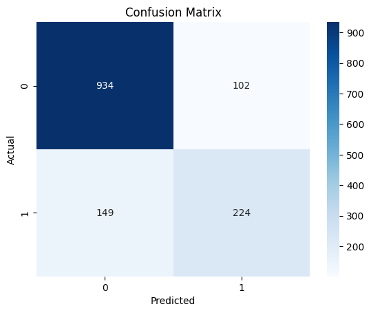
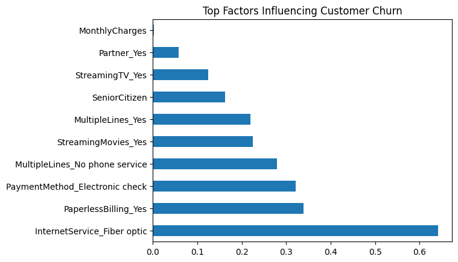

# Customer Churn Prediction

This project predicts telecom customer churn using machine learning.

## Project Overview

Customer churn is a major problem for telecom companies. This project analyzes customer behavior and predicts whether a customer will leave the service.

## Dataset

Telco Customer Churn dataset containing 7043 customers with 21 features.

## Technologies Used

- Python
- Pandas
- NumPy
- Matplotlib
- Seaborn
- Scikit-learn

## Machine Learning Model

Logistic Regression was used to predict churn.

Model Accuracy: **82%**

## Key Insights

Customers are more likely to churn if they:

- Use fiber optic internet
- Use paperless billing
- Pay via electronic check
- Have multiple services

## Project Workflow

1. Data Cleaning
2. Exploratory Data Analysis
3. Feature Engineering
4. Model Training
5. Model Evaluation
6. Business Insights

## Results

The model achieved **82% accuracy** in predicting customer churn.

## Model Performance

### Confusion Matrix

### Top Factors Influencing Customer Churn

## Author

Aryann Jain